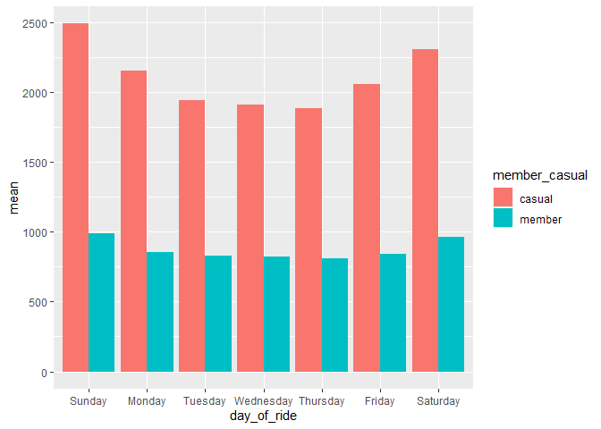

Google\_Data\_Analytics
================
Meshaal Mujeeb

## Data Processing in excel

All the excel files were inserted in an excel workbook for initial
processing. Further

1.  Duplicates were removed from the datasets (if any existed)

2.  Made sure proper naming convention is used in the dataset.

3.  Two new columns were added for the analysis process

    -   ride\_length – Length of the ride. To calculate this variable,
        the started\_at column was subtracted from the ended\_at column.

    -   day\_of\_ride – The weekday on which the ride started This
        values for this column were found using the =WEEKDAY() function.
        The date for which the day had to be found was taken as values
        of started\_at column. Sunday = 1 to Saturday = 7

4.  Made sure the data type assigned to each column is appropriate. This
    helps in calculation and removing error while importing the datasets

    -   The started\_at and ended\_at columns were converted into the
        datetime type (format = mm/dd/yyyy hh:mm:ss)

    -   The ride\_length column was converted to date type (format =
        hh:mm:ss)

#### Sheet vise inspection

1.  In sheet 202101-divvy-tripdata, two values in the ride\_length
    column was found to have “\#\#\#\#\#” value. This was a calculated
    column. The error was in the started\_at and ended\_at column. The
    values in two rows were interchanged. It was corrected and the
    correct ride\_length values were found.

2.  In sheet 202103-divvy-tripdata, the same error was found in two
    rows. It was corrected and the correct ride\_length values were
    found.

3.  In sheet 202104-divvy-tripdata, the same error was found in five
    rows. It was corrected and the correct ride\_length values were
    found.

4.  In sheet 202105-divvy-tripdata, the same error was found in two
    rows. It was corrected and the correct ride\_length values were
    found.

5.  In sheet 202106-divvy-tripdata, the same error was found in five
    rows. It was corrected and the correct ride\_length values were
    found.

6.  In sheet 202106-divvy-tripdata, the same error was found in thirteen
    rows. It was corrected and the correct ride\_length values were
    found.

### Installing and loading the required packages

``` r
library(tidyverse)
```

    ## -- Attaching packages --------------------------------------- tidyverse 1.3.1 --

    ## v ggplot2 3.3.5     v purrr   0.3.4
    ## v tibble  3.1.4     v dplyr   1.0.7
    ## v tidyr   1.1.3     v stringr 1.4.0
    ## v readr   2.0.1     v forcats 0.5.1

    ## -- Conflicts ------------------------------------------ tidyverse_conflicts() --
    ## x dplyr::filter() masks stats::filter()
    ## x dplyr::lag()    masks stats::lag()

``` r
library(ggplot2)
library(readr)
library(lubridate)
```

    ## 
    ## Attaching package: 'lubridate'

    ## The following objects are masked from 'package:base':
    ## 
    ##     date, intersect, setdiff, union

``` r
library(dplyr)
library(tidyr)
library(skimr)
```

### Importing the datasets

All the datasets are imported into R. The columns started\_at and
ended\_at are formatted as datetime.

``` r
cyclistic_data_JAN <- read_csv("~/Cyclistic_data1/Cyclistic_data_2021/202101-divvy-tripdata.csv",
                               col_types = cols(started_at = col_datetime(format = "%m/%d/%Y %H:%M:%S"), 
                                                ended_at = col_datetime(format = "%m/%d/%Y %H:%M:%S")))
cyclistic_data_FEB <- read_csv("~/Cyclistic_data1/Cyclistic_data_2021/202102-divvy-tripdata.csv",
                               col_types = cols(started_at = col_datetime(format = "%m/%d/%Y %H:%M:%S"), 
                                                ended_at = col_datetime(format = "%m/%d/%Y %H:%M:%S")))
cyclistic_data_MAR <- read_csv("~/Cyclistic_data1/Cyclistic_data_2021/202103-divvy-tripdata.csv",
                               col_types = cols(started_at = col_datetime(format = "%m/%d/%Y %H:%M:%S"), 
                                                ended_at = col_datetime(format = "%m/%d/%Y %H:%M:%S")))
cyclistic_data_APR <- read_csv("~/Cyclistic_data1/Cyclistic_data_2021/202104-divvy-tripdata.csv",
                               col_types = cols(started_at = col_datetime(format = "%m/%d/%Y %H:%M:%S"), 
                                                ended_at = col_datetime(format = "%m/%d/%Y %H:%M:%S")))
cyclistic_data_MAY <- read_csv("~/Cyclistic_data1/Cyclistic_data_2021/202105-divvy-tripdata.csv",
                               col_types = cols(started_at = col_datetime(format = "%m/%d/%Y %H:%M:%S"), 
                                                ended_at = col_datetime(format = "%m/%d/%Y %H:%M:%S")))
cyclistic_data_JUN <- read_csv("~/Cyclistic_data1/Cyclistic_data_2021/202106-divvy-tripdata.csv",
                               col_types = cols(started_at = col_datetime(format = "%m/%d/%Y %H:%M:%S"), 
                                                ended_at = col_datetime(format = "%m/%d/%Y %H:%M:%S")))
cyclistic_data_JUL <- read_csv("~/Cyclistic_data1/Cyclistic_data_2021/202107-divvy-tripdata.csv",
                               col_types = cols(started_at = col_datetime(format = "%m/%d/%Y %H:%M:%S"), 
                                                ended_at = col_datetime(format = "%m/%d/%Y %H:%M:%S")))
```

### Binding the datasets together

All the datasets are binded together to form an all trips dataset

``` r
all_trips_data <- bind_rows(cyclistic_data_JAN,cyclistic_data_FEB,cyclistic_data_MAR, 
                            cyclistic_data_APR,cyclistic_data_MAY,cyclistic_data_JUN,cyclistic_data_JUL)
tibble(all_trips_data)
```

    ## # A tibble: 2,795,820 x 15
    ##    ride_id          rideable_type started_at          ended_at           
    ##    <chr>            <chr>         <dttm>              <dttm>             
    ##  1 E19E6F1B8D4C42ED electric_bike 2021-01-23 16:14:19 2021-01-23 16:24:44
    ##  2 DC88F20C2C55F27F electric_bike 2021-01-27 18:43:08 2021-01-27 18:47:12
    ##  3 EC45C94683FE3F27 electric_bike 2021-01-21 22:35:54 2021-01-21 22:37:14
    ##  4 4FA453A75AE377DB electric_bike 2021-01-07 13:31:13 2021-01-07 13:42:55
    ##  5 BE5E8EB4E7263A0B electric_bike 2021-01-23 02:24:02 2021-01-23 02:24:45
    ##  6 5D8969F88C773979 electric_bike 2021-01-09 14:24:07 2021-01-09 15:17:54
    ##  7 09275CC10F854E9E electric_bike 2021-01-04 05:05:04 2021-01-04 05:10:39
    ##  8 DF7A32A217AEFB14 electric_bike 2021-01-14 15:07:00 2021-01-14 15:13:40
    ##  9 C2EFC62379EB716C electric_bike 2021-01-09 09:57:55 2021-01-09 10:00:26
    ## 10 B9F73448DFBE0D45 classic_bike  2021-01-24 19:15:38 2021-01-24 19:22:51
    ## # ... with 2,795,810 more rows, and 11 more variables:
    ## #   start_station_name <chr>, start_station_id <chr>, end_station_name <chr>,
    ## #   end_station_id <chr>, start_lat <dbl>, start_lng <dbl>, end_lat <dbl>,
    ## #   end_lng <dbl>, member_casual <chr>, ride_length <chr>, day_of_ride <dbl>

### Data Processing

First step was to Convert the ride\_length column from character to
timespan. Further a new column was created showing the calculated ride
duration in seconds. This column was made for easier calculations.
Another column with the month of ride filtered out was created for the
same purpose. These number were formatted as month names and the
existing Day\_of\_ride column was formatted as names of the days of the
week.

#### Converting the ride\_length column from character to timespan

``` r
work_sheet1 <- all_trips_data %>% mutate(ride_length = hms(ride_length))
```

#### Creating a column for the month the ride started

``` r
work_sheet1$ride_month <- as.numeric(format(work_sheet1$started_at, '%m'))
```

#### Creating a column for the time duration of ride in seconds

``` r
work_sheet1 <- mutate(work_sheet1, time_duration = difftime(work_sheet1$ended_at,work_sheet1$started_at, units = "secs"))
work_sheet1$time_duration <- as.numeric(as.character(work_sheet1$time_duration))
```

    ## # A tibble: 6 x 17
    ##   ride_id          rideable_type started_at          ended_at            start_station_n~
    ##   <chr>            <chr>         <dttm>              <dttm>              <chr>           
    ## 1 E19E6F1B8D4C42ED electric_bike 2021-01-23 16:14:19 2021-01-23 16:24:44 California Ave ~
    ## 2 DC88F20C2C55F27F electric_bike 2021-01-27 18:43:08 2021-01-27 18:47:12 California Ave ~
    ## 3 EC45C94683FE3F27 electric_bike 2021-01-21 22:35:54 2021-01-21 22:37:14 California Ave ~
    ## 4 4FA453A75AE377DB electric_bike 2021-01-07 13:31:13 2021-01-07 13:42:55 California Ave ~
    ## 5 BE5E8EB4E7263A0B electric_bike 2021-01-23 02:24:02 2021-01-23 02:24:45 California Ave ~
    ## 6 5D8969F88C773979 electric_bike 2021-01-09 14:24:07 2021-01-09 15:17:54 California Ave ~
    ## # ... with 12 more variables: start_station_id <chr>, end_station_name <chr>,
    ## #   end_station_id <chr>, start_lat <dbl>, start_lng <dbl>, end_lat <dbl>,
    ## #   end_lng <dbl>, member_casual <chr>, ride_length <Period>,
    ## #   day_of_ride <dbl>, ride_month <dbl>, time_duration <dbl>

#### Converting the day\_of\_ride column to character

``` r
work_sheet1$day_of_ride <- as.character(work_sheet1$day_of_ride)
work_sheet1$day_of_ride[work_sheet1$day_of_ride == "1"] <- "Sunday"
work_sheet1$day_of_ride[work_sheet1$day_of_ride == "2"] <- "Monday"
work_sheet1$day_of_ride[work_sheet1$day_of_ride == "3"] <- "Tuesday"
work_sheet1$day_of_ride[work_sheet1$day_of_ride == "4"] <- "Wednesday"
work_sheet1$day_of_ride[work_sheet1$day_of_ride == "5"] <- "Thursday"
work_sheet1$day_of_ride[work_sheet1$day_of_ride == "6"] <- "Friday"
work_sheet1$day_of_ride[work_sheet1$day_of_ride == "7"] <- "Saturday"
work_sheet1$day_of_ride <- ordered(work_sheet1$day_of_ride, 
                                   levels=c("Sunday", "Monday", "Tuesday", "Wednesday", "Thursday", "Friday", "Saturday"))
```

#### Naming the values in the ride\_month column

``` r
work_sheet1$ride_month[work_sheet1$ride_month == "1"] <- "January"
work_sheet1$ride_month[work_sheet1$ride_month == "2"] <- "February"
work_sheet1$ride_month[work_sheet1$ride_month == "3"] <- "March"
work_sheet1$ride_month[work_sheet1$ride_month == "4"] <- "April"
work_sheet1$ride_month[work_sheet1$ride_month == "5"] <- "May"
work_sheet1$ride_month[work_sheet1$ride_month == "6"] <- "June"
work_sheet1$ride_month[work_sheet1$ride_month == "7"] <- "July"
work_sheet1$ride_month <- ordered(work_sheet1$ride_month, 
                                   levels=c("January", "February", "March", "April", "May", "June", "July"))
```

## Descriptive Analysis

Summary of the time duration rides completed by members and casual
riders

``` r
summary(work_sheet1$ride_length)
```

    ##                    Min.                 1st Qu.                  Median 
    ##                    "0S"                "7M 20S"                "13M 4S" 
    ##                    Mean                 3rd Qu.                    Max. 
    ## "23M 37.3186954095763S"               "23M 46S"       "37d 10H 41M 36S"

``` r
summary(work_sheet1$time_duration)
```

    ##    Min. 1st Qu.  Median    Mean 3rd Qu.    Max. 
    ##       0     440     784    1477    1426 3356649

``` r
d_member <- work_sheet1 %>% filter(member_casual == "member") 
summary(d_member$ride_length)
```

    ##                    Min.                 1st Qu.                  Median 
    ##                    "0S"                 "6M 0S"               "10M 20S" 
    ##                    Mean                 3rd Qu.                    Max. 
    ## "14M 25.2452553163407S"               "17M 43S"         "1d 1H 59M 56S"

``` r
quantile(d_member$ride_length)
```

    ## [1] "0S"          "6M 0S"       "10M 20S"     "17M 43S"     "25H 59M 56S"

``` r
d_casual <- work_sheet1 %>%  filter(member_casual == "casual")
summary(d_casual$ride_length)
```

    ##                    Min.                 1st Qu.                  Median 
    ##                    "0S"                "9M 48S"               "17M 25S" 
    ##                    Mean                 3rd Qu.                    Max. 
    ## "33M 55.8611019047646S"                "32M 6S"       "37d 10H 41M 36S"

``` r
quantile(d_casual$ride_length)
```

    ## [1] "0S"           "9M 48S"       "17M 25S"      "32M 6S"       "898H 41M 36S"

### Finding the stations with highest footfall

``` r
head(count(work_sheet1, start_station_name, member_casual, sort = TRUE))
```

    ## # A tibble: 6 x 3
    ##   start_station_name        member_casual      n
    ##   <chr>                     <chr>          <int>
    ## 1 <NA>                      member        139808
    ## 2 <NA>                      casual        134867
    ## 3 Streeter Dr & Grand Ave   casual         38266
    ## 4 Lake Shore Dr & Monroe St casual         19617
    ## 5 Millennium Park           casual         19311
    ## 6 Michigan Ave & Oak St     casual         17021

``` r
head(count(work_sheet1, end_station_name, member_casual, sort = TRUE))
```

    ## # A tibble: 6 x 3
    ##   end_station_name          member_casual      n
    ##   <chr>                     <chr>          <int>
    ## 1 <NA>                      casual        156219
    ## 2 <NA>                      member        142056
    ## 3 Streeter Dr & Grand Ave   casual         39641
    ## 4 Millennium Park           casual         19806
    ## 5 Lake Shore Dr & Monroe St casual         18264
    ## 6 Michigan Ave & Oak St     casual         17768

``` r
head(count(filter(work_sheet1, member_casual == "casual"), start_station_name, member_casual, sort = TRUE))
```

    ## # A tibble: 6 x 3
    ##   start_station_name         member_casual      n
    ##   <chr>                      <chr>          <int>
    ## 1 <NA>                       casual        134867
    ## 2 Streeter Dr & Grand Ave    casual         38266
    ## 3 Lake Shore Dr & Monroe St  casual         19617
    ## 4 Millennium Park            casual         19311
    ## 5 Michigan Ave & Oak St      casual         17021
    ## 6 Lake Shore Dr & North Blvd casual         14853

``` r
head(count(filter(work_sheet1, member_casual == "casual"), end_station_name, member_casual, sort = TRUE))
```

    ## # A tibble: 6 x 3
    ##   end_station_name           member_casual      n
    ##   <chr>                      <chr>          <int>
    ## 1 <NA>                       casual        156219
    ## 2 Streeter Dr & Grand Ave    casual         39641
    ## 3 Millennium Park            casual         19806
    ## 4 Lake Shore Dr & Monroe St  casual         18264
    ## 5 Michigan Ave & Oak St      casual         17768
    ## 6 Lake Shore Dr & North Blvd casual         17439

``` r
head(count(filter(work_sheet1, member_casual == "member"), start_station_name, member_casual, sort = TRUE))
```

    ## # A tibble: 6 x 3
    ##   start_station_name       member_casual      n
    ##   <chr>                    <chr>          <int>
    ## 1 <NA>                     member        139808
    ## 2 Clark St & Elm St        member         13058
    ## 3 Wells St & Concord Ln    member         12039
    ## 4 Kingsbury St & Kinzie St member         11368
    ## 5 Wells St & Elm St        member         10868
    ## 6 Dearborn St & Erie St    member         10186

``` r
head(count(filter(work_sheet1, member_casual == "member"), end_station_name, member_casual, sort = TRUE))
```

    ## # A tibble: 6 x 3
    ##   end_station_name         member_casual      n
    ##   <chr>                    <chr>          <int>
    ## 1 <NA>                     member        142056
    ## 2 Clark St & Elm St        member         13155
    ## 3 Wells St & Concord Ln    member         12360
    ## 4 Kingsbury St & Kinzie St member         11401
    ## 5 Wells St & Elm St        member         11111
    ## 6 Dearborn St & Erie St    member         10655

### Studying the missing stations and stations ids

``` r
tibble(count(filter(work_sheet1, is.na(start_station_name)), start_station_name, rideable_type, sort = TRUE))
```

    ## # A tibble: 1 x 3
    ##   start_station_name rideable_type      n
    ##   <chr>              <chr>          <int>
    ## 1 <NA>               electric_bike 274675

``` r
tibble(count(filter(work_sheet1, is.na(end_station_name)), end_station_name, rideable_type, sort = TRUE))
```

    ## # A tibble: 2 x 3
    ##   end_station_name rideable_type      n
    ##   <chr>            <chr>          <int>
    ## 1 <NA>             electric_bike 293377
    ## 2 <NA>             classic_bike    4898

### Number of rides that lasted below a minute

``` r
length(which(work_sheet1$time_duration < 60))
```

    ## [1] 43104

``` r
work_sheet1 %>% filter(time_duration < 60) %>%  group_by(member_casual) %>% summarise(n = n()) %>% 
  mutate(Percetage = 100*(n/sum(n)))
```

    ## # A tibble: 2 x 3
    ##   member_casual     n Percetage
    ##   <chr>         <int>     <dbl>
    ## 1 casual        18339      42.5
    ## 2 member        24765      57.5

### Number of rides that lasted above a day

``` r
length(which(work_sheet1$time_duration > 86400))
```

    ## [1] 2289

``` r
work_sheet1 %>% filter(time_duration > 86400) %>%  group_by(member_casual) %>% summarise(n = n()) %>% 
  mutate(Percetage = 100*(n/sum(n)))
```

    ## # A tibble: 2 x 3
    ##   member_casual     n Percetage
    ##   <chr>         <int>     <dbl>
    ## 1 casual         2042      89.2
    ## 2 member          247      10.8

### Number of rides per membership (casual and member)

``` r
work_sheet1 %>% group_by(member_casual) %>% summarise(n = n()) %>% 
  mutate(percentage = 100 * (n/sum(n)))
```

    ## # A tibble: 2 x 3
    ##   member_casual       n percentage
    ##   <chr>           <int>      <dbl>
    ## 1 casual        1318535       47.2
    ## 2 member        1477285       52.8

### Number of rides by types of bikes

``` r
work_sheet1 %>% group_by(rideable_type) %>% summarise(n = n()) %>% 
  mutate(Percetage = 100*(n/sum(n)))
```

    ## # A tibble: 3 x 3
    ##   rideable_type       n Percetage
    ##   <chr>           <int>     <dbl>
    ## 1 classic_bike  1714898     61.3 
    ## 2 docked_bike    196515      7.03
    ## 3 electric_bike  884407     31.6

### Number of rides made by member and casual users by types of bike

``` r
work_sheet1 %>% filter(member_casual == "member") %>% group_by(rideable_type) %>% summarise(n = n()) %>%
  mutate(Percentage = 100 *(n/sum(n)))
```

    ## # A tibble: 3 x 3
    ##   rideable_type       n Percentage
    ##   <chr>           <int>      <dbl>
    ## 1 classic_bike  1030956 69.8      
    ## 2 docked_bike         1  0.0000677
    ## 3 electric_bike  446328 30.2

``` r
work_sheet1 %>% filter(member_casual == "casual") %>% group_by(rideable_type) %>% summarise(n = n()) %>%
  mutate(Percentage = 100 *(n/sum(n)))
```

    ## # A tibble: 3 x 3
    ##   rideable_type      n Percentage
    ##   <chr>          <int>      <dbl>
    ## 1 classic_bike  683942       51.9
    ## 2 docked_bike   196514       14.9
    ## 3 electric_bike 438079       33.2

### Number of rides through days of the week

``` r
work_sheet1 %>% group_by(day_of_ride) %>% summarise(n = n()) %>%
  mutate(Percentage = 100 *(n/sum(n)))
```

    ## # A tibble: 7 x 3
    ##   day_of_ride      n Percentage
    ##   <ord>        <int>      <dbl>
    ## 1 Sunday      430609       15.4
    ## 2 Monday      346162       12.4
    ## 3 Tuesday     364829       13.0
    ## 4 Wednesday   366266       13.1
    ## 5 Thursday    353904       12.7
    ## 6 Friday      411003       14.7
    ## 7 Saturday    523047       18.7

### Number of rides made by member and casual users by days of the week

``` r
work_sheet1 %>% group_by(day_of_ride) %>% summarise(n = n()) %>%
  mutate(Percentage = 100 *(n/sum(n)))
```

    ## # A tibble: 7 x 3
    ##   day_of_ride      n Percentage
    ##   <ord>        <int>      <dbl>
    ## 1 Sunday      430609       15.4
    ## 2 Monday      346162       12.4
    ## 3 Tuesday     364829       13.0
    ## 4 Wednesday   366266       13.1
    ## 5 Thursday    353904       12.7
    ## 6 Friday      411003       14.7
    ## 7 Saturday    523047       18.7

``` r
work_sheet1 %>% filter(member_casual == "casual") %>% group_by(day_of_ride) %>% summarise(n = n()) %>%
  mutate(Percentage = 100 *(n/sum(n)))
```

    ## # A tibble: 7 x 3
    ##   day_of_ride      n Percentage
    ##   <ord>        <int>      <dbl>
    ## 1 Sunday      247624       18.8
    ## 2 Monday      148511       11.3
    ## 3 Tuesday     145798       11.1
    ## 4 Wednesday   142479       10.8
    ## 5 Thursday    142341       10.8
    ## 6 Friday      190212       14.4
    ## 7 Saturday    301570       22.9

``` r
options(scipen = 999)
work_sheet1 %>% group_by(member_casual, day_of_ride) %>% summarise(number_of_rides = n()) %>%
  arrange(member_casual, day_of_ride) %>% ggplot(aes(x = day_of_ride, y = number_of_rides, fill = member_casual, colour = member_casual)) + 
  geom_col(position = "dodge")
```

    ## `summarise()` has grouped output by 'member_casual'. You can override using the `.groups` argument.

<!-- -->

### Number of rides through the first 7 months of the year

``` r
options(scipen = 999)
work_sheet1 %>% group_by(ride_month) %>% summarise(n = n()) %>% 
  mutate(percentage = 100 * (n/sum(n)))
```

    ## # A tibble: 7 x 3
    ##   ride_month      n percentage
    ##   <ord>       <int>      <dbl>
    ## 1 January     96834       3.46
    ## 2 February    49622       1.77
    ## 3 March      228496       8.17
    ## 4 April      337230      12.1 
    ## 5 May        531633      19.0 
    ## 6 June       729595      26.1 
    ## 7 July       822410      29.4

``` r
work_sheet1 %>% filter(member_casual == "member") %>% group_by(ride_month) %>% summarise(n = n()) %>%
  mutate(Percentage = 100 *(n/sum(n)))
```

    ## # A tibble: 7 x 3
    ##   ride_month      n Percentage
    ##   <ord>       <int>      <dbl>
    ## 1 January     78717       5.33
    ## 2 February    39491       2.67
    ## 3 March      144463       9.78
    ## 4 April      200629      13.6 
    ## 5 May        274717      18.6 
    ## 6 June       358914      24.3 
    ## 7 July       380354      25.7

``` r
work_sheet1 %>% filter(member_casual == "casual") %>% group_by(ride_month) %>% summarise(n = n()) %>%
  mutate(Percentage = 100 *(n/sum(n)))
```

    ## # A tibble: 7 x 3
    ##   ride_month      n Percentage
    ##   <ord>       <int>      <dbl>
    ## 1 January     18117      1.37 
    ## 2 February    10131      0.768
    ## 3 March       84033      6.37 
    ## 4 April      136601     10.4  
    ## 5 May        256916     19.5  
    ## 6 June       370681     28.1  
    ## 7 July       442056     33.5

``` r
work_sheet1 %>% group_by(member_casual, ride_month) %>% summarise(number_of_rides = n()) %>%
  arrange(member_casual, ride_month) %>% ggplot(aes(x = ride_month, y = number_of_rides, fill = member_casual, colour = member_casual)) + 
  geom_col(position = "dodge")
```

    ## `summarise()` has grouped output by 'member_casual'. You can override using the `.groups` argument.

<!-- -->

### Comparing the ride length of member and casual users by each day

``` r
aggregate(work_sheet1$time_duration ~ work_sheet1$member_casual + work_sheet1$day_of_ride, FUN = mean)
```

    ##    work_sheet1$member_casual work_sheet1$day_of_ride work_sheet1$time_duration
    ## 1                     casual                  Sunday                 2490.5588
    ## 2                     member                  Sunday                  989.7674
    ## 3                     casual                  Monday                 2155.6163
    ## 4                     member                  Monday                  851.0971
    ## 5                     casual                 Tuesday                 1941.4007
    ## 6                     member                 Tuesday                  826.4972
    ## 7                     casual               Wednesday                 1908.9305
    ## 8                     member               Wednesday                  820.4948
    ## 9                     casual                Thursday                 1884.4469
    ## 10                    member                Thursday                  807.5551
    ## 11                    casual                  Friday                 2054.4812
    ## 12                    member                  Friday                  841.9688
    ## 13                    casual                Saturday                 2306.9356
    ## 14                    member                Saturday                  961.8071

``` r
work_sheet1 %>% group_by(member_casual, day_of_ride) %>% summarise(mean = mean(time_duration)) %>% ggplot(aes(x = day_of_ride,y = mean, fill = member_casual)) + geom_col(position = "dodge")
```

    ## `summarise()` has grouped output by 'member_casual'. You can override using the `.groups` argument.

<!-- -->

### Comparing the ride length of member and casual users by each month

``` r
aggregate(work_sheet1$time_duration ~ work_sheet1$member_casual + work_sheet1$ride_month, FUN = mean)
```

    ##    work_sheet1$member_casual work_sheet1$ride_month work_sheet1$time_duration
    ## 1                     casual                January                 1541.0754
    ## 2                     member                January                  772.3220
    ## 3                     casual               February                 2962.3937
    ## 4                     member               February                 1081.3251
    ## 5                     casual                  March                 2289.5239
    ## 6                     member                  March                  838.1973
    ## 7                     casual                  April                 2281.3794
    ## 8                     member                  April                  881.3315
    ## 9                     casual                    May                 2293.8580
    ## 10                    member                    May                  878.3347
    ## 11                    casual                   June                 2227.2869
    ## 12                    member                   June                  880.6689
    ## 13                    casual                   July                 1967.4105
    ## 14                    member                   July                  854.3592

``` r
work_sheet1 %>% group_by(member_casual, ride_month) %>% summarise(mean = mean(time_duration)) %>% ggplot(aes(x = ride_month,y = mean, fill = member_casual)) + geom_col(position = "dodge")
```

    ## `summarise()` has grouped output by 'member_casual'. You can override using the `.groups` argument.

<!-- -->

### Number\_of\_rides v ride\_duration scatter plot

``` r
work_sheet1  %>% group_by(member_casual, time_duration) %>% summarise(number_of_rides = n()) %>%
  ggplot(aes(x = time_duration, y = number_of_rides, colour = member_casual)) + geom_point()
```

    ## `summarise()` has grouped output by 'member_casual'. You can override using the `.groups` argument.

<!-- -->

## Removing the outliers

### Graphical representation of outliers

``` r
outliers_m <- boxplot(d_member$time_duration, plot = FALSE)$out #Finding
outliers_c <- boxplot(d_casual$time_duration, plot = FALSE)$out #Finding
```

### Removing The outliers

``` r
eliminated_member <- d_member
eliminated_member <- eliminated_member[-which(eliminated_member$time_duration %in% outliers_m),] #Removing
eliminated_casual <- d_casual
eliminated_casual <- eliminated_casual[-which(eliminated_casual$time_duration %in% outliers_c),] #Removing
```

### Number\_of\_trips v time\_duration graph

``` r
eliminated <- bind_rows(eliminated_member, eliminated_casual)
eliminated  %>% group_by(member_casual, time_duration) %>% summarise(number_of_rides = n()) %>%
  ggplot(aes(x = time_duration, y = number_of_rides, colour = member_casual)) + geom_point()
```

    ## `summarise()` has grouped output by 'member_casual'. You can override using the `.groups` argument.

<!-- -->

### Comparing the ride length of member and casual users by each day in the eliminated dataset

``` r
eliminated %>% group_by(member_casual, day_of_ride) %>% summarise(mean = mean(time_duration)) %>% ggplot(aes(x = day_of_ride,y = mean, fill = member_casual)) + geom_col(position = "dodge")
```

    ## `summarise()` has grouped output by 'member_casual'. You can override using the `.groups` argument.

<!-- -->

### Comparing the ride length of member and casual users by each month in the eliminated dataset

``` r
eliminated %>% group_by(member_casual, ride_month) %>% summarise(mean = mean(time_duration)) %>% ggplot(aes(x = ride_month,y = mean, fill = member_casual)) + geom_col(position = "dodge")
```

    ## `summarise()` has grouped output by 'member_casual'. You can override using the `.groups` argument.

<!-- -->

### Preffered ride times for casual riders and members

``` r
work_sheet1 %>%  mutate(hours_of_ride = format(as.POSIXct(started_at), format = "%H")) %>% 
  group_by(hours_of_ride, member_casual) %>% 
  summarise(number_of_rides = n()) %>% 
  ggplot(aes(x = hours_of_ride, y = number_of_rides, fill = member_casual)) + geom_col(position = "dodge") 
```

    ## `summarise()` has grouped output by 'hours_of_ride'. You can override using the `.groups` argument.

<!-- -->
